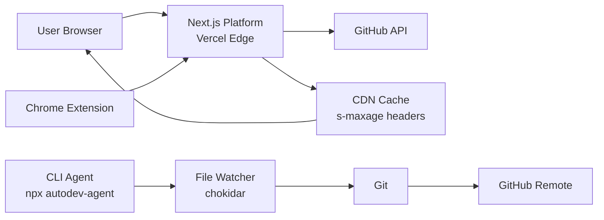

<div align="center">
  <picture>
    <source media="(prefers-color-scheme: dark)" srcset="https://autodev-kappa.vercel.app/api/og?username=autodev&theme=dark">
    
  </picture>
</div>

<h1 align="center">AutoDev</h1>

<p align="center">
  <strong>GitHub Profile Analyzer · README Generator · Auto-Git Agent</strong>
  <br />
  <em>Analyze any GitHub profile in seconds. Generate beautiful READMEs. Auto-commit and push your code.</em>
</p>

<div align="center">
  <a href="https://autodev-kappa.vercel.app"></a>
  <a href="https://www.npmjs.com/package/autodev-agent"></a>
  <a href="https://www.npmjs.com/package/autodev-agent"></a>
  <a href="./LICENSE"></a>
  <a href="./COMMERCIAL_LICENSE.md"></a>
  <a href="./.github/workflows/ci.yml"></a>
  <a href="https://github.com/Shashwat1319/autodev-agent"></a>
  <a href="https://github.com/Shashwat1319/autodev-agent/issues"></a>
</div>

<div align="center">
  <a href="https://autodev-kappa.vercel.app/dashboard?user=Shashwat1319">
    
  </a>
</div>

---

## ✨ What is AutoDev?

**Three tools, one mission: make every GitHub profile look amazing.**

| Tool | What it does | Try it |
|------|-------------|--------|
| 🧠 **Profile Analyzer** | Score/100, language breakdown, top repos, streak stats | [`/dashboard`](https://autodev-kappa.vercel.app/dashboard) |
| 📝 **README Generator** | 3 styles (Professional / Minimal / Recruiter) — preview, copy, download | [`/readme-generator`](https://autodev-kappa.vercel.app/readme-generator) |
| 🤖 **Auto-Git Agent** | Watches files, auto-commits with smart debouncing, pushes to GitHub | `npx autodev-agent` |

No login. No signup. No database. 100% free. All data comes from the GitHub API.

---

## 🆓 Free vs 💎 Pro

| Feature | Free | Pro (₹499) |
|---------|------|------------|
| Profile Score & Analysis | ✅ | ✅ |
| Language Breakdown | ✅ | ✅ |
| Top Repos & Stats | ✅ | ✅ |
| Classic Badge | ✅ | ✅ |
| Recruiter-Ready README | ❌ | ✅ |
| Gold/Dark Badges | ❌ | ✅ |
| Prioritized Fix Plan | ❌ | ✅ |
| Repo Deep Dive (weaknesses/strengths) | ❌ | ✅ |
| Signed Badge URLs (90 days) | ❌ | ✅ |

[Upgrade to Pro →](https://autodev-kappa.vercel.app/dashboard) *(one-time ₹499, 48h delivery, money-back guarantee)*

---

## 🚀 Quick Start

### Analyze a profile

```bash
# Open in browser
open https://autodev-kappa.vercel.app/dashboard?user=YOUR_USERNAME

# Or get a JSON response
curl "https://autodev-kappa.vercel.app/api/analyze?username=YOUR_USERNAME"
```

### Add a badge to your README

```markdown
[](https://autodev-kappa.vercel.app/dashboard?user=YOUR_USERNAME)
```

### Run the CLI agent (no install needed)

```bash
npx autodev-agent
```

---

## 🖥️ Platform Features

<div align="center">
  <table>
    <tr>
      <td align="center"><br /><sub>Profile scored on consistency, stars, repos, bio</sub></td>
      <td align="center"><br /><sub>Language breakdown with color-coded bars</sub></td>
      <td align="center"><br /><sub>Sorted by stars with clickable links</sub></td>
    </tr>
    <tr>
      <td align="center"><br /><sub>Commit streak and contribution heat</sub></td>
      <td align="center"><br /><sub>Leaderboard with search and filters</sub></td>
      <td align="center"><br /><sub>Auto-generated social previews</sub></td>
    </tr>
  </table>
</div>

### 📸 Screenshots

> *Screenshots coming soon. In the meantime, visit [autodev-kappa.vercel.app](https://autodev-kappa.vercel.app) to see it live.*

---

## 🤖 CLI Agent (`npx autodev-agent`)

A file watcher that auto-commits and pushes your code — no more typing `git add`, `git commit`, `git push` a hundred times a day.

```bash
# One-command run (no install)
npx autodev-agent

# Or install globally
npm install -g autodev-agent
```

Configure with `~/.autodev/config.json`:

```json
{
  "repos": [
    {
      "localPath": "/path/to/your/project",
      "remoteUrl": "https://github.com/you/project.git",
      "branch": "main",
      "enabled": true
    }
  ],
  "autoCommit": true,
  "autoPush": true,
  "commitThreshold": 60,
  "commitMessagePattern": "auto: updated {files}",
  "maxChangesBeforeCommit": 10,
  "ignoredPaths": ["node_modules", ".git", "dist", "build", ".next"]
}
```

[📖 Full agent documentation →](agent/README.md)

---

## 🌐 Chrome Extension

See any GitHub user's AutoDev score instantly — right on their profile page.

| | |
|---|---|
| **Install** | Not yet on Chrome Web Store. Load unpacked from `chrome-extension/` |
| **Userscript** | Tampermonkey version at [`docs/autodev-github-score.user.js`](docs/autodev-github-score.user.js) |
| **How it works** | Injects score badge next to profile name on `github.com/*` |

---

## 🏗️ Architecture



| Component | Stack | Hosting |
|-----------|-------|---------|
| **Platform** | Next.js 14 (Pages Router) + Tailwind CSS | Vercel (free) |
| **Agent** | Node.js CLI (chokidar + simple-git) | npm package |
| **Extension** | Chrome MV3 + Tampermonkey userscript | Unpacked / OpenUserJS |
| **Monitoring** | Sentry v8 (client + server + edge) | SaaS |
| **Testing** | Vitest + Testing Library (30 tests) | CI |
| **CI/CD** | GitHub Actions (lint + typecheck + test + build) | GitHub |

---

## 🛡️ Security

| Control | Status |
|---------|--------|
| Content Security Policy | ✅ Strict allowlist |
| HSTS | ✅ 2-year max-age, preload |
| X-Frame-Options | ✅ DENY |
| X-Content-Type-Options | ✅ nosniff |
| Permissions-Policy | ✅ Camera/mic/geo restricted |
| Rate Limiting | ✅ Per-IP (defense-in-depth) |
| Input Validation | ✅ Regex on all API routes |
| Token Handling | ✅ Lazy getter (no top-level env read) |

---

## 🗺️ Roadmap

| Milestone | Status | Target |
|-----------|--------|--------|
| v1.0.0 — Core analyzer, README gen, agent, extension | ✅ Released | Jul 2026 |
| Chrome Web Store publication | 🔜 Next | Aug 2026 |
| Vercel KV for persistent rate limiting | 📋 Planned | Q3 2026 |
| `@vercel/og` migration (replace `sharp`) | 📋 Planned | Q3 2026 |
| Custom README templates (community submissions) | 💡 Idea | Q4 2026 |
| Team/org profile analysis | 💡 Idea | Q4 2026 |
| GitHub Action (CI score gate) | 💡 Idea | Q1 2027 |

[📋 Full changelog →](CHANGELOG.md)

---

## 🤝 Contributing

We welcome contributions! Whether it's fixing a bug, adding a feature, improving docs, or writing tests — all help is appreciated.

- [Contributing guide](CONTRIBUTING.md)
- [Code of Conduct](CODE_OF_CONDUCT.md)
- [Security policy](SECURITY.md)
- [Architecture docs](docs/architecture/README.md)
- [Architecture decisions (ADRs)](docs/adr/)

**Good first issues:** Check [`good first issue` label](https://github.com/Shashwat1319/autodev-agent/labels/good%20first%20issue).

---

## 📦 Packages

| Package | Version | Links |
|---------|---------|-------|
| `autodev-agent` (npm) | [](https://www.npmjs.com/package/autodev-agent) | [npm](https://www.npmjs.com/package/autodev-agent) |
| `autodev-platform` (private) | 1.0.0 | [Website](https://autodev-kappa.vercel.app) |
| Chrome Extension (unpublished) | 1.0.0 | [`chrome-extension/`](chrome-extension/) |

---

## 📄 License

MIT © [Shashwatsrivastava](https://github.com/Shashwat1319)

---

<div align="center">
  <sub>
    Built with ❤️ by <a href="https://github.com/Shashwat1319">Shashwatsrivastava</a>
    ·
    <a href="https://autodev-kappa.vercel.app">Website</a>
    ·
    <a href="https://www.npmjs.com/package/autodev-agent">npm</a>
    ·
    <a href="https://github.com/Shashwat1319/autodev-agent">GitHub</a>
    ·
    <a href="https://buymeacoffee.com/shashwatsrivastava">Buy me a coffee ☕</a>
  </sub>
  <br />
  <sub><a href="https://autodev-kappa.vercel.app">autodev-kappa.vercel.app</a></sub>
</div>
